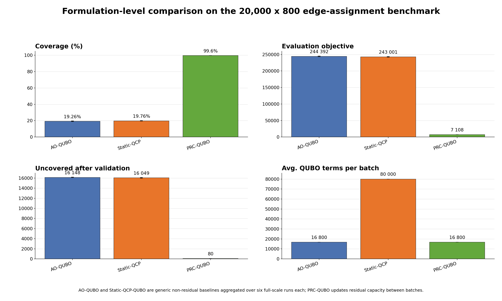

# PRC-QUBO Decomposition for Large-Scale Sensor-to-Server Assignment

[](https://www.python.org/)
[](https://www.openjij.org/)
[](https://dwave-neal-docs.readthedocs.io/)

This repository accompanies the current Applied Soft Computing manuscript draft on **priority-aware residual-capacity QUBO decomposition (PRC-QUBO)** for large-scale sensor-to-server assignment in smart-city edge systems.

The main contribution is formulation-level: the work studies which QUBO representation is appropriate for a sequential, capacity-constrained edge-resource allocation problem where accepted assignments consume server capacity and change the feasible region for later batches. Solver behavior is evaluated after that formulation question is fixed.

The benchmark uses a synthetic but reproducible city-scale instance with:

- `20,000` sensors/cameras
- `800` heterogeneous edge servers
- fixed random seed `42`
- priority classes, sensor loads, bandwidth demands, server capacities, coordinates, and a shared assignment-cost matrix
- batch decomposition into `80 x 20` QUBO subproblems

## Contents

- [Research Focus](#research-focus)
- [Problem Setting](#problem-setting)
- [QUBO Formulations](#qubo-formulations)
- [Execution Pipeline](#execution-pipeline)
- [Experimental Results](#experimental-results)
- [Reproducing Runs](#reproducing-runs)
- [Logs and Figures](#logs-and-figures)
- [OpenJij Installation Notes](#openjij-installation-notes)
- [Repository Structure](#repository-structure)
- [Citation](#citation)

## Research Focus

Earlier versions of this project emphasized a direct comparison between simulated quantum annealing (SQA) and simulated annealing (SA). The current manuscript shifts the emphasis to the QUBO formulation itself.

The benchmark demonstrates that the QUBO seen by the solver must represent the current residual server capacity in order to produce feasible assignments in this sequential edge-resource allocation setting.

To answer this, the repository contains three QUBO formulations evaluated under the same benchmark protocol:

| Formulation | Capacity information inside the sampled QUBO | Purpose |
|---|---|---|
| **AO-QUBO** | None | Assignment-only baseline |
| **Static-QCP-QUBO** | Initial server capacity `K_j` | Static quadratic capacity-penalty baseline |
| **PRC-QUBO** | Current residual capacity `R_j^(t)` | Proposed state-aware decomposition |

SQA and SA are then treated as solver backends. Within PRC-QUBO, they solve the same residual-capacity-aware batch Hamiltonians and differ only in the annealing dynamics and implementation.

## Problem Setting

Let:

- `C` be the set of sensors/cameras
- `S` be the set of edge servers
- `x_ij in {0,1}` indicate whether sensor `i` is assigned to server `j`
- `c_ij` be the normalized assignment cost
- `l_i` be the computational load of sensor `i`
- `K_j` be the initial processing capacity of server `j`
- `p_i in {1,2,3}` be the priority level of sensor `i`

The target assignment problem combines:

- low assignment cost
- one server per assigned sensor
- server-capacity feasibility
- high-priority sensors processed earlier in the sequence

A direct full assignment model would contain:

```text
20,000 x 800 = 16,000,000 binary assignment variables
```

Even the one-hot assignment penalty alone would generate:

```text
20,000 * C(800, 2) = 6,392,000,000 pairwise terms
```

This is why the implementation uses iterative batch decomposition instead of a monolithic QUBO.

## QUBO Formulations

All QUBO models use the standard binary quadratic form:

```math
H_QUBO(x) =
\sum_u Q_{u,u}x_u
+
\sum_{u<v}Q_{u,v}x_u x_v .
```

Raw QUBO energies are not compared across formulations, because each Hamiltonian contains different penalty terms. The final comparison uses the common post-hoc evaluation objective: assignment cost, uncovered-sensor penalty, overload penalty, and validated coverage.

### Full Target Assignment QUBO

The manuscript first presents the conceptual full target assignment QUBO:

```math
H_full(x)
=
\sum_{i,j} c_{i,j}x_{i,j}
+
\lambda_1\sum_i
\left(
\sum_j x_{i,j}-1
\right)^2
+
\lambda_2\sum_j
\left[
\max
\left(
0,
\sum_i l_i x_{i,j}-K_j
\right)
\right]^2 .
```

This form is useful for describing the target constrained assignment objective. It is not constructed directly at city scale because the capacity penalty either requires slack variables or introduces dense server-wise couplings.

### PRC-QUBO Decomposition

PRC-QUBO replaces the full QUBO with a sequence of residual-capacity-aware batch subproblems.

For batch `t`, let:

- `B_t` be the selected sensor batch
- `S_t` be the selected candidate-server subset
- `R_j^(t)` be the residual capacity of server `j` before solving batch `t`

Residual capacity is updated as:

```math
R_j^{(t)}
=
K_j
-
\sum_{\tau<t}
\sum_{i\in B_\tau}
l_i x_{i,j}.
```

The batch-level PRC-QUBO Hamiltonian is:

```math
H_t^{PRC}(x)
=
\sum_{i\in B_t}
\sum_{j\in S_t}
\phi_{i,j}^{(t)}x_{i,j}
+
\lambda
\sum_{i\in B_t}
\sum_{\substack{j,k\in S_t\\j<k}}
x_{i,j}x_{i,k}.
```

The residual-capacity-dependent linear coefficient is:

```math
\phi_{i,j}^{(t)}
=
-\alpha r_i(1-c_{i,j})I(l_i <= R_j^{(t)})
+
\beta I(l_i > R_j^{(t)}).
```

Equivalently:

```math
\phi_{i,j}^{(t)}
=
\begin{cases}
-\alpha r_i(1-c_{i,j}), & l_i <= R_j^{(t)},\\
+\beta, & l_i > R_j^{(t)}.
\end{cases}
```

The released implementation uses:

| Parameter | Value | Role |
|---|---:|---|
| `alpha` | 25 | feasible-assignment reward scale |
| `beta` | 100 | infeasible pair penalty |
| `lambda` | 15 | same-sensor multi-selection penalty |

The priority term is not the only priority mechanism. Operational priority is represented jointly by:

- sorting sensors by `p_i l_i` before batching
- including priority in the cost construction
- using the priority-related weight in the PRC-QUBO coefficient
- decoding, validation, repair, and post-processing

The quadratic term discourages multiple server selections for the same sensor, but it is not claimed to be a complete exact-penalty reformulation of the full ILP. Final feasibility is enforced by binary decoding, residual-capacity validation, repair/fallback logic in the PRC-QUBO pipelines, local post-processing, and residual-state updates.

Each released PRC-QUBO batch contains:

```text
80 x 20 = 1,600 binary variables
80 * C(20, 2) = 15,200 one-hot pairwise terms
16,800 total linear + quadratic QUBO coefficients per full batch
```

### AO-QUBO Baseline

AO-QUBO is the assignment-only baseline. It uses the same batch variables and solver interface, but capacity is not represented inside the sampled Hamiltonian.

For each batch:

```math
H_t^{AO}(x)
=
\sum_{i\in B_t}
\sum_{j\in S_t}
\left(c_{ij}-\lambda_A\right)x_{ij}
+
2\lambda_A
\sum_{i\in B_t}
\sum_{\substack{j,k\in S_t\\j<k}}
x_{ij}x_{ik}.
```

This is the expanded form of:

```math
\sum_{i,j}c_{ij}x_{ij}
+
\lambda_A\sum_i
\left(
\sum_j x_{ij}-1
\right)^2
```

after dropping constants and using `x_ij^2 = x_ij`.

AO-QUBO is not deliberately broken. It is a valid lower-information QUBO baseline for assignment structure. Its limitation is that capacity information enters only after solving, during the shared residual-capacity validation stage.

### Static-QCP-QUBO Baseline

Static-QCP-QUBO augments AO-QUBO with a static quadratic capacity penalty based on initial capacities.

Let:

```math
\tilde{l}_i = l_i / K_{max},
\qquad
\tilde{K}_j = K_j / K_{max}.
```

The compact form is:

```math
H_t^{StaticQCP}(x)
=
H_t^{AO}(x)
+
\lambda_K
\sum_{j\in S_t}
\left(
\sum_{i\in B_t}
\tilde{l}_i x_{ij}
-
\tilde{K}_j
\right)^2 .
```

The implemented expanded form is:

```math
H_t^{StaticQCP}(x)
=
\sum_{i\in B_t}\sum_{j\in S_t}
\left[
c_{ij}
- \lambda_A
+ \lambda_K
\left(
\tilde{l}_i^2
- 2\tilde{K}_j\tilde{l}_i
\right)
\right]x_{ij}
+
2\lambda_A
\sum_{i\in B_t}
\sum_{\substack{j,k\in S_t\\j<k}}
x_{ij}x_{ik}
+
2\lambda_K
\sum_{j\in S_t}
\sum_{\substack{i,k\in B_t\\i<k}}
\tilde{l}_i\tilde{l}_k x_{ij}x_{kj}.
```

Static-QCP-QUBO represents the initial-capacity level of modeling. It exposes capacity information to the solver, but the penalty remains tied to `K_j`, not to the residual state `R_j^(t)` produced by earlier committed batches. The squared term behaves as a static capacity target, not as an exact inequality encoding of `sum_i l_i x_ij <= K_j`.

The full `80 x 20` Static-QCP-QUBO batches contain about:

```text
1,600 linear terms
78,400 quadratic terms
80,000 total QUBO coefficients
```

## Execution Pipeline

The common benchmark pipeline is:

1. Generate the synthetic `20,000 x 800` instance using seed `42`.
2. Build priority, load, bandwidth, capacity, coordinate, and cost arrays.
3. Process sensors in priority-aware batches of size `80`.
4. Select up to `20` candidate servers per batch.
5. Build one of the three QUBO formulations.
6. Solve the batch QUBO with either SQA or SA.
7. Decode the raw binary/spin sample into candidate assignments.
8. Validate decoded assignments against current residual capacities.
9. Commit feasible assignments and update `R_j^(t)`.
10. Log batch-level and final metrics.

For the formulation benchmark, AO-QUBO and Static-QCP-QUBO use the same input stream, batch size, candidate-server budget, solvers, decoding, validation, and final evaluation objective as PRC-QUBO. Their non-residual nature is localized to the QUBO-construction block.

For publication baseline runs, final local optimization is not used for the non-residual baselines. This keeps AO-QUBO and Static-QCP-QUBO as formulation baselines rather than optimized hybrid methods.

## Experimental Results

### Formulation-Level Comparison

The formulation-level comparison aggregates full-scale runs on the same `20,000 x 800` benchmark.

| Formulation | Capacity state in QUBO | Runs | Coverage mean +/- sd | Covered | Uncovered | Evaluation objective | Avg. QUBO terms |
|---|---|---:|---:|---:|---:|---:|---:|
| **AO-QUBO** | No capacity term | 6 | 19.26 +/- 0.32% | 3,853 | 16,148 | 244,392 +/- 928 | 16,800 |
| **Static-QCP-QUBO** | Static initial `K_j` | 6 | 19.76 +/- 0.34% | 3,951 | 16,049 | 243,001 +/- 1,000 | 80,000 |
| **PRC-QUBO** | Residual `R_j^(t)` | 10 | 99.60 +/- 0.00% | 19,920 | 80 | about 7,108 | 16,800 |

The key result is not that AO-QUBO or Static-QCP-QUBO are invalid QUBOs. They are valid non-residual formulations. Their weakness in this benchmark is that they solve a stale approximation of a sequential problem: after earlier batches consume capacity, later low-energy decoded assignments often fail residual-capacity validation.

Static-QCP-QUBO increases the average number of QUBO coefficients from `16,800` to `80,000`, but improves coverage by less than one percentage point over AO-QUBO. PRC-QUBO preserves the smaller AO-style batch scale while making the sampled Hamiltonian aware of the current residual resource state.



### Non-Residual Baselines by Solver

| Baseline + solver | Coverage mean +/- sd | Objective mean +/- sd | Time (s) mean +/- sd | Failed batches | Avg. QUBO terms |
|---|---:|---:|---:|---:|---:|
| **AO-QUBO + SQA** | 19.15 +/- 0.47% | 244,758 +/- 1,324 | 192.6 +/- 96.9 | 227.7 | 16,800 |
| **AO-QUBO + SA** | 19.38 +/- 0.00% | 244,026 +/- 0 | 1,702.6 +/- 268.2 | 226.0 | 16,800 |
| **Static-QCP-QUBO + SQA** | 19.47 +/- 0.18% | 243,865 +/- 509 | 1,219.2 +/- 1,443.0 | 226.0 | 80,000 |
| **Static-QCP-QUBO + SA** | 20.05 +/- 0.00% | 242,137 +/- 0 | 1,885.1 +/- 61.4 | 226.0 | 80,000 |

Changing the annealing backend does not rescue the non-residual formulations. The limiting factor is the mismatch between the capacity state represented in the sampled Hamiltonian and the residual capacity used for final feasibility checking.

### PRC-QUBO Solver-Level Comparison

After the formulation issue is removed by using PRC-QUBO, the solver-level comparison focuses on backend behavior.

| Method | Objective value | Coverage (%) | Mean time (s) | Mean throughput (cam/s) |
|---|---:|---:|---:|---:|
| **PRC-QUBO + SQA** | 7,108.3 | 99.6 | 299.61 | 66.46 |
| **PRC-QUBO + SA** | 7,108.1 | 99.6 | 2,779.26 | 7.22 |
| **Priority-capacity greedy baseline** | 225,163.4 | 25.33 | 180.01 | 28.14 |

SQA and SA reach comparable PRC-QUBO assignment quality, while the implemented OpenJij SQA-backed pipeline is about `9.3x` faster than the Neal SA-backed pipeline in the reported benchmark. This is an implementation-level solver result inside the PRC-QUBO decomposition, not a claim of universal quantum advantage.

## Reproducing Runs

### Create a Virtual Environment

Windows PowerShell:

```powershell
py -3.10 -m venv .venv
.\.venv\Scripts\Activate.ps1
python -m pip install --upgrade pip setuptools wheel
```

Linux/macOS:

```bash
python3.10 -m venv .venv
source .venv/bin/activate
python -m pip install --upgrade pip setuptools wheel
```

### Install Dependencies

The current `requirements.txt` records pinned packages as individual `pip install ...` commands. For a clean environment, the most reliable option is to install the same pinned packages directly:

```powershell
pip install numpy==1.24.3 pandas==2.0.3 scipy==1.10.1 openjij==0.11.6 dwave-neal==0.5.5 dimod==0.12.6 dash==2.14.0 plotly==5.15.0 python-dateutil==2.8.2
```

### Smoke Tests

Use reduced problem sizes before full-scale runs:

```powershell
python ao_qubo_sa.py --n-cameras 500 --n-servers 25 --batch-size 20 --max-servers-per-batch 5 --num-reads 10 --log-every 5
python ao_qubo_sqa.py --n-cameras 500 --n-servers 25 --batch-size 20 --max-servers-per-batch 5 --num-reads 10 --log-every 5
python static_qcp_qubo_sa.py --n-cameras 500 --n-servers 25 --batch-size 20 --max-servers-per-batch 5 --num-reads 10 --log-every 5
python static_qcp_qubo_sqa.py --n-cameras 500 --n-servers 25 --batch-size 20 --max-servers-per-batch 5 --num-reads 10 --log-every 5
```

### Full Baseline Runs

The full baseline scripts default to the paper-scale `20,000 x 800` problem.

```powershell
python ao_qubo_sqa.py --log-every 10
python ao_qubo_sa.py --log-every 10
python static_qcp_qubo_sqa.py --log-every 10
python static_qcp_qubo_sa.py --log-every 10
```

For publication-style non-residual baseline runs, do not add `--final-opt`.

### PRC-QUBO Runs

The original PRC-QUBO solver-backed pipelines are:

```powershell
python main_Q.py
python main.py
```

`main_Q.py` runs the OpenJij SQA-backed PRC-QUBO pipeline. `main.py` runs the Neal SA-backed PRC-QUBO pipeline.

### Regenerate the Formulation Comparison Figure

The figure script reads the stored JSON summaries and PRC-QUBO reference logs.

```powershell
python scripts\plot_formulation_comparison.py --show-data
```

Expected outputs:

```text
manuscript_revision/figures/formulation_comparison_600dpi.png
manuscript_revision/figures/qubo_comparison_graphs_cropped.pdf
```

## Logs and Figures

The non-residual baselines use the same logging style as the PRC-QUBO experiments: run-level summaries plus batch-level progress files.

Important directories:

| Directory | Contents |
|---|---|
| `logs_ao_qubo_sqa/` | AO-QUBO + SQA summaries and progress logs |
| `logs_ao_qubo_sa/` | AO-QUBO + SA summaries and progress logs |
| `logs_static_qcp_qubo_sqa/` | Static-QCP-QUBO + SQA summaries and progress logs |
| `logs_static_qcp_qubo_sa/` | Static-QCP-QUBO + SA summaries and progress logs |
| `logs_openjij_windows/` | PRC-QUBO + SQA logs from the Windows/OpenJij runs |
| `logs/` | PRC-QUBO + SA logs and earlier classical run outputs |
| `manuscript_revision/figures/` | Paper figures generated from logs |

Typical baseline log files:

```text
summary_YYYYMMDD_HHMMSS.json
progress_YYYYMMDD_HHMMSS.jsonl
```

The summary JSON files contain final coverage, objective value, total time, throughput, failed/weak batches, fallback count, rejected assignments, and QUBO structural metrics such as variables, linear terms, quadratic terms, coefficient range, and average QUBO coefficient count.

## OpenJij Installation Notes

The SQA-backed pipeline uses the standard Python package:

```python
import openjij as oj
sampler = oj.SQASampler()
response = sampler.sample_qubo(Q, num_reads=..., num_sweeps=...)
```

The official OpenJij documentation describes OpenJij as a heuristic optimization library for Ising and QUBO models with a Python interface and C++ core, installable with:

```bash
pip install openjij
```

This repository pins:

```bash
openjij==0.11.6
```

### Recommended Windows Installation

Use Python 3.10 in a clean virtual environment. This avoids many wheel and dependency issues that appear with newer Python versions.

```powershell
py -3.10 -m venv .venv
.\.venv\Scripts\Activate.ps1
python -m pip install --upgrade pip setuptools wheel
python -m pip install numpy==1.24.3 scipy==1.10.1 dimod==0.12.6 openjij==0.11.6
python -m pip install dwave-neal==0.5.5 pandas==2.0.3 dash==2.14.0 plotly==5.15.0
```

Verify:

```powershell
python -c "import openjij as oj; print(oj.__version__); print(oj.SQASampler())"
python -c "import neal; print('neal ok')"
```

If installation fails:

- Check that the active interpreter is the project venv: `python -c "import sys; print(sys.executable)"`.
- Upgrade build helpers: `python -m pip install --upgrade pip setuptools wheel`.
- Prefer Python 3.10 or 3.11 rather than Python 3.13.
- If pip tries to compile from source on Windows, install Microsoft C++ Build Tools and CMake.
- If exact reproduction is not required, try `pip install openjij` without the version pin.

### CPU, GPU, and CUDA

The experiments reported in this repository use the normal OpenJij Python interface on conventional CPU hardware. No physical quantum processor is used, and no CUDA-specific code path is enabled by the repository scripts.

OpenJij documentation exposes lower-level C++/core interfaces and mentions GPU-implemented classical and quantum Ising model systems. Older PyPI documentation also notes that GPGPU algorithms require building OpenJij from source with CUDA detected by CMake. That is a different installation path from the standard binary `pip install openjij` workflow.

For this project:

- CUDA is **not required**.
- Installing CUDA alone will **not** make these scripts use the GPU.
- The reported SQA results are produced through `openjij.SQASampler()` as used from Python.
- A GPU-enabled OpenJij experiment would need an explicit source/GPU build and code-level verification that the GPU backend is actually selected.
- If you use a GPU-enabled build in future work, report it separately because runtime values would no longer be directly comparable with the current CPU-based benchmark logs.

## Repository Structure

```text
QAnnealing/
|-- main_Q.py                         # PRC-QUBO + OpenJij SQA pipeline
|-- main.py                           # PRC-QUBO + Neal SA pipeline
|-- ao_qubo_sqa.py                    # AO-QUBO + SQA baseline
|-- ao_qubo_sa.py                     # AO-QUBO + SA baseline
|-- static_qcp_qubo_sqa.py            # Static-QCP-QUBO + SQA baseline
|-- static_qcp_qubo_sa.py             # Static-QCP-QUBO + SA baseline
|-- greedy.py                         # priority-capacity greedy reference
|-- scripts/
|   |-- plot_formulation_comparison.py
|-- manuscript_revision/
|   |-- figures/
|       |-- formulation_comparison_600dpi.png
|       |-- qubo_comparison_graphs_cropped.pdf
|-- logs_ao_qubo_sqa/
|-- logs_ao_qubo_sa/
|-- logs_static_qcp_qubo_sqa/
|-- logs_static_qcp_qubo_sa/
|-- logs_openjij_windows/
|-- logs/
|-- requirements.txt
|-- README.md
```

## Citation

If you use this repository or its benchmark results, cite the associated manuscript and repository.

```bibtex
@misc{mussabayev2026prcqubo,
  title        = {Priority-Aware Residual-Capacity QUBO Decomposition for Large-Scale Sensor-to-Server Assignment in Smart City Edge Systems},
  author       = {Mussabayev, Yedige and Bykov, Artem and Lavrov, Evgeniy},
  year         = {2026},
  howpublished = {Manuscript submitted to Applied Soft Computing; GitHub repository},
  url          = {https://github.com/Yedman3585/Quantum-Sensor-Assignment}
}
```

## License and Acknowledgments

This repository accompanies the scientific manuscript on PRC-QUBO decomposition for smart-city sensor-to-server assignment.

The research and software development were led by Yedige Mussabayev. Scientific supervision and methodological guidance were provided by Artem Bykov. Additional scientific review and recommendations were provided by Evgeniy Lavrov.
