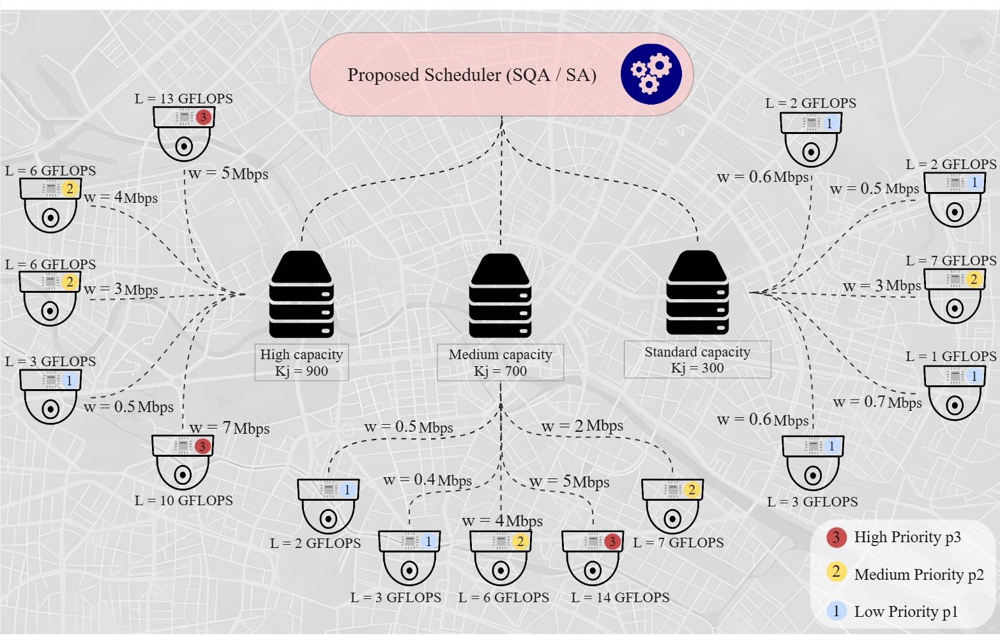
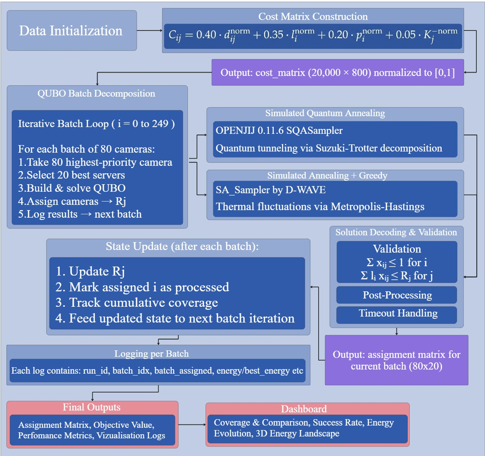

# Quantum-Inspired Optimization for Sensor-to-Server Assignment in Smart-City Surveillance Systems

[](https://www.python.org/downloads/)
[](https://github.com/Jij-Inc/OpenJij) 
[](https://dwave-neal-docs.readthedocs.io/en/latest/reference/sampler.html)
---

## 📋 Table of Contents
- [1. Introduction](#1-introduction)
- [2. Problem Formulation](#2-problem-formulation-and-input-data)
- [3. QUBO Formulation](#3-qubo-formulation)
- [4. Optimization Approaches](#4-optimization-approaches)
- [5. Results and Visualization](#5-results-and-visualization)
- [6. Getting Started](#6-getting-started)
- [7. Repository Structure](#7-repository-structure)
- [8. Citation](#8-citation)
- [9. License and Acknowledgments](#9-license-and-acknowledgments)

---

## 1. Introduction


**The main question of this work: Can simulated quantum annealing (SQA) with batch decomposition solve real-life camera-to-edge-server assignment problems with 20,000 cameras and 800 servers more effectively than classical optimization approaches, while maintaining practical runtime and full reproducibility using open-source tools?**


The given work is completely experimentally reproducible*. Unlike proprietary quantum hardware solutions that may have variable access or performance characteristics, our framework leverages:

- **OpenJij** — An open-source framework for the Ising model and QUBO problems, developed and maintained by Jij Inc.
- **Fixed random seeds** — All experiments use NumPy seed 42 for deterministic data generation
- **Structured JSONL logging** — Every batch's metrics are recorded for post-hoc analysis
- **Version-controlled dependencies** — Exact library versions specified for environment recreation

Thus, anyone can replicate our experiments by:
1. Installing OpenJij 0.11.6 (as used in this study)
2. Running the provided Python scripts with identical parameters
3. Comparing results against our logs 

The OpenJij framework implements Simulated Quantum Annealing (SQA) through path-integral Monte Carlo with Trotter decomposition, making quantum-inspired optimization accessible on standard computing hardware without requiring access to physical quantum processors.

### Key Topics

| Topic | Description |
|-------|-------------|
| **Simulated Quantum Annealing (SQA)** | Quantum-inspired optimization using OpenJij's path-integral Monte Carlo with Trotter decomposition |
| **Simulated Annealing (SA)** | Classical probabilistic metaheuristic implemented via D-Wave's Neal library |
| **QUBO** | Quadratic Unconstrained Binary Optimization — NP-hard problem formulation |
| **Smart City Sensors** | 20,000 cameras with heterogeneous priorities and computational loads |
| **Distributed Data Processing** | Edge computing architecture with 800 servers of varying capacities |


## 2. Problem Formulation and Input Data

Let $C = \{1, 2, \dots, 20000\}$ denote the set of surveillance cameras and $S = \{1, 2, \dots, 800\}$ the set of edge servers.

**Camera Parameters:**
- $p_i \in \{1,2,3\}$ — priority level of camera $i$ (3 = highest, 2 = middle, 1 = lowest)
- $w_i = 4 - p_i \in \{1,2,3\}$ — priority weight (higher value → higher reward)
- $l_i > 0$ — computational demand of camera $i$ (in GFLOPs)

**Server Parameters:**
- $K_j > 0$ — total processing capacity of server $j$ (in GFLOPs)

**Decision Variable:**
$$
x_{ij} = \begin{cases} 
1, & \text{if camera } i \text{ is assigned to server } j \\
0, & \text{otherwise}
\end{cases}
$$

**Constraints:**

1. **Unique assignment constraint:** Each camera must be assigned to exactly one server
   $$
   \sum_{j=1}^{M} x_{ij} = 1, \quad \forall i = 1,\ldots,N
   $$

2. **Server capacity constraint:** The total computational load on each server must not exceed its processing capacity
   $$
   \sum_{i=1}^{N} l_i x_{ij} \leq K_j, \quad \forall j = 1,\ldots,M
   $$


The normalized assignment cost $c_{ij} \in [0,1]$ represents the cost of connecting camera $i$ to server $j$, incorporating four weighted factors:

$$
c_{ij} = 0.40 \cdot \frac{d_{ij}}{d_{\text{max}}} + 0.35 \cdot \frac{l_i}{l_{\text{max}}} + 0.20 \cdot \frac{3-p_i}{2} + 0.05 \cdot \frac{K_{\text{max}}/K_j}{(K_{\text{max}}/K_{\text{min}})}
$$

where:
- $d_{ij}$ — Euclidean distance between camera $i$ and server $j$
- $d_{\text{max}}$ — maximum distance across all camera-server pairs
- $l_{\text{max}}$ — maximum computational load across all cameras
- $K_{\text{max}}, K_{\text{min}}$ — maximum and minimum server capacities

**Weight distribution:**
- **40% Network latency** — prioritizes physical proximity to minimize transmission delays
- **35% Computational load** — balances processing demands across servers
- **20% Priority weighting** — ensures high-priority cameras receive better service
- **5% Capacity utilization** — lightly favors underutilized servers for load balancing

The resulting cost matrix is min-max normalized to $[0,1]$ to ensure numerical stability during the annealing process.

### Data Generation
To ensure a realistic evaluation of the scheduling algorithms, we generate synthetic data mimicking a large-scale video surveillance system with 20,000 cameras and 800 servers. The data generation process is identical for both Simulated Annealing (SA) and Simulated Quantum Annealing (SQA) methods, using **fixed random seed 42** for perfect reproducibility across all experiments.

| Parameter | Distribution | Details |
|-----------|--------------|---------|
| **Camera Priorities** | $p_i = 3$ (15%), $p_i = 2$ (25%), $p_i = 1$ (60%) | High: pedestrian crossings<br>Medium: sidewalks<br>Low: roadways |
| **Camera Load (GFLOPs)** | High: $l_i \sim \mathcal{U}[8,15]$<br>Medium: $l_i \sim \mathcal{U}[4,8]$<br>Low: $l_i \sim \mathcal{U}[1,3]$ | Computational demand for AI-based video analytics |
| **Server Capacities (GFLOPs)** | High: $K_j \sim \mathcal{U}[800,1000]$ (10%)<br>Medium: $K_j \sim \mathcal{U}[400,800]$ (30%)<br>Standard: $K_j \sim \mathcal{U}[200,400]$ (60%) | Heterogeneous edge server infrastructure |
| **Geographic Distribution** | $(x,y) \sim \mathcal{U}[0,1000]^2$ | Uniform random placement in $1000 \times 1000$ grid |

**System-wide metrics:**
- Total computational load: $\displaystyle \sum_{i=1}^{N} l_i \approx 88,453$ GFLOPs
- Total server capacity: $\displaystyle \sum_{j=1}^{M} K_j \approx 372,166$ GFLOPs
- System utilization: $\approx 23.8\%$




*The figure illustrates 3 edge servers with capacities 800–1000 GFLOPs (high), 400–800 GFLOPs (medium), and 200–400 GFLOPs (standard), with 15 cameras distributed by priority: 15% high (red: pedestrian crossings), 25% medium (yellow: sidewalks), and 60% low (blue: roadways). Computational loads ($l_i$ in GFLOPs) are annotated near cameras, following the uniform distributions described above.*

---

## 3. QUBO Formulation

### From ILP to QUBO

The constrained Integer Linear Programming (ILP) problem is transformed into an Quadratic Unconstrained Binary Optimization (QUBO) problem using a penalty-reward approach:

$$
H_{\text{QUBO}}(\mathbf{x}) = \underbrace{\sum_{i=1}^{N}\sum_{j=1}^{M} c_{ij} x_{ij}}_{\text{Primary cost}} + \lambda_1 \underbrace{\sum_{i=1}^{N} \left(\sum_{j=1}^{M} x_{ij} - 1\right)^2}_{\text{Assignment penalty}} + \lambda_2 \underbrace{\sum_{j=1}^{M} \max\left(0, \sum_{i=1}^{N} l_i x_{ij} - K_j\right)^2}_{\text{Capacity penalty}}
$$

where $\lambda_1, \lambda_2 > 0$ are penalty coefficients chosen sufficiently large to enforce constraint satisfaction.

### Batch-Level Hamiltonian

Due to the huge size of the full problem (16 million binary variables), we decompose it into tractable subproblems using an iterative batch strategy. For each batch of $n$ cameras $B$ and $m$ candidate servers $S$, the QUBO Hamiltonian is constructed as:

$$
H(\mathbf{x}) = \sum_{i \in B} \sum_{j \in S} Q_{ij}^{(1)} x_{ij} + \lambda \sum_{i \in B} \sum_{\substack{j,k \in S \\ j < k}} x_{ij} x_{ik}
$$

where $\mathbf{x} = \{x_{ij} \in \{0,1\}\}$ represents binary assignment variables for the current batch.

### Coefficient Definition

The linear coefficients $Q_{ij}^{(1)}$ encode feasibility and objective preferences:

$$
Q_{ij}^{(1)} = \begin{cases} 
-\alpha \cdot w_i \cdot (1 - c_{ij}), & \text{if } l_i \leq R_j \\
+\beta, & \text{otherwise}
\end{cases}
$$

where:
- $w_i = 4 - p_i \in \{1,2,3\}$ — priority weight
- $c_{ij} \in [0,1]$ — normalized connection cost
- $l_i > 0$ — camera computational load
- $R_j > 0$ — remaining server capacity at batch time
- $\alpha, \beta, \lambda$ — experimentally tuned constants

### QUBO Parameters

| Parameter | Value | Description |
|-----------|-------|-------------|
| $\alpha$ | 25 | Reward coefficient for feasible assignments |
| $\beta$ | 100 | Penalty for capacity violations |
| $\lambda$ | 15 | Penalty for multiple assignments (one-hot encoding) |

### Encoding Three Key Aspects

This formulation encodes:

1. **Primary objective** — via reward term $-\alpha w_i(1-c_{ij})$ for feasible assignments:
   - Higher priority cameras ($w_i$ larger) receive stronger negative coefficients
   - Lower connection costs ($c_{ij}$ smaller) produce larger rewards
   - The negative sign makes better assignments lower-energy states

2. **Capacity constraints** — through large penalty $\beta$ for infeasible pairs where $l_i > R_j$:
   - Any assignment violating server capacity gets a high positive contribution to energy
   - The optimizer avoids these configurations during annealing

3. **One-hot assignment** — via quadratic term $\lambda x_{ij}x_{ik}$:
   - For a given camera $i$, assigning it to two different servers $j$ and $k$ creates a positive energy contribution
   - This enforces $\sum_j x_{ij} \leq 1$ without hard constraints
   - The coefficient $\lambda$ is tuned to balance against the objective terms


## 4. Optimization Approaches

### Architectural Overview





The architecture features **fully shared preprocessing stages** (Data Initialization, Cost Matrix Construction, and QUBO Batch Decomposition) before branching into the three solving approaches:

1. **Simulated Quantum Annealing (SQA)** — OpenJij SQASampler
2. **Classical Simulated Annealing (SA)** — D-Wave Neal
3. **Greedy Baseline** — Deterministic heuristic

### Batch Decomposition Strategy

Due to the problem scale (20,000 cameras × 800 servers), we implement an iterative batch strategy:

$$
\text{Total variables} = N \times M = 20,000 \times 800 = 16,000,000
$$

The batch decomposition reduces each subproblem to:

$$
\text{Batch variables} = B \times M = 80 \times 20 = 1,600
$$

**Algorithm:**
1. **Step 1:** Initialize remaining server capacities $R_j = K_j$
2. **Step 2:** Sort cameras by priority score = $p_i \times l_i$ (higher first)
3. **Step 3:** While unassigned cameras remain:
    * Select next batch of $B = 80$ highest-priority unassigned cameras
    * Select $M = 20$ candidate servers with largest remaining capacity $R_j$
    * Construct QUBO subproblem with current remaining capacities $R_j$
    * Solve QUBO using SQA, SA, or Greedy
    * Update assignments and reduce server capacities
4. **Step 4:** Apply local optimization to improve assignments across batch boundaries


### Simulated Quantum Annealing (SQA) with OpenJij

**Library:** OpenJij 0.11.6 ([official documentation](https://jij-inc.github.io/OpenJij/))  
**Sampler:** `SQASampler` (Simulated Quantum Annealing)  
**Core Mechanism:** Path-Integral Monte Carlo with Trotter decomposition

SQA transforms the $N$-variable QUBO into an extended $(N \times P)$-variable classical Ising model via the Suzuki-Trotter decomposition:

$$
H_{\text{SQA}} = -\frac{1}{P}\sum_{k=1}^{P} H_{\text{QUBO}}^{(k)} - J_{\perp} \sum_{k=1}^{P} \sum_{i=1}^{N} \sigma_{i,k} \sigma_{i,k+1}
$$

where:
- $P = 8$ — Trotter slices (replicas)
- $H_{\text{QUBO}}^{(k)}$ — the $k$-th replica of the QUBO Hamiltonian
- $\sigma_{i,k} \in \{\pm 1\}$ — classical Ising spins
- $J_{\perp}$ — inter-replica coupling strength simulating quantum tunneling

**Key Parameters:**
- Trotter number ($P$): 8 — balances simulation fidelity and computational cost
- Monte Carlo sweeps: 1000 — annealing duration
- Transverse field schedule: geometric decrease from $\Gamma_0$ to near-zero

**OpenJij Implementation:**
```python
import openjij as oj

sampler = oj.SQASampler(
    trotter=8,           # Number of replicas (P)
    num_sweeps=1000,     # Monte Carlo steps
    num_reads=10         # Parallel runs per batch
)

response = sampler.sample_qubo(Q)  # Q is the QUBO matrix
```

### Classical Simulated Annealing (SA)

* **Library:** D-Wave Neal (`SimulatedAnnealingSampler`)
* **Core Mechanism:** Metropolis-Hastings with thermal fluctuations

The algorithm interprets the QUBO objective as an energy function to be minimized:

$$H(\sigma) = \sum_{i<j} J_{ij}\sigma_i\sigma_j + \sum_{i} h_i\sigma_i$$

where binary variables $x_i \in \{0,1\}$ correspond to spins via $\sigma_i = 2x_i - 1$.

**Dynamics:** The Metropolis-Hastings acceptance rule governs state transitions:
* If $\Delta E < 0$: always accept (downhill move).
* Else: accept with probability $\exp(-\Delta E / T)$.

**Key Parameters:**
* **Number of reads:** 150 — independent annealing runs.
* **Cooling schedule:** geometric with $\alpha = 0.995$.
* **Initial temperature:** sufficiently high for broad exploration.

---

### Greedy Baseline

* **Mechanism:** Deterministic assignment using priority-capacity scoring.

For each camera (processed in priority order), select the server maximizing:

$$\text{score}_{ij} = w_i \cdot (1 - c_{ij}) \cdot \frac{R_j}{K_j}$$

**Where:**
* $w_i = 4 - p_i$ — priority weight.
* $c_{ij}$ — connection cost.
* $R_j$ — remaining capacity.
* $K_j$ — total capacity.

**Timeout:** 180 seconds — ensures practical runtime for comparison.


## 5. Results and Visualization

### Final Performance Comparison

| Method | Objective Value | Coverage (%) | Total Time (s) | Core Time (s) | Eff. (%) | Throughput (cam/s) |
| :--- | :---: | :---: | :---: | :---: | :---: | :---: |
| **Simulated Quantum Annealing (SQA)** | 7,108.1 | 99.6 | 1,162.92 | 1,058.81 | 91.1% | 17.13 |
| **Classical Simulated Annealing (SA)** | 7,108.1 | 99.6 | 5,082.57 | 4,985.86 | 98.1% | 3.92 |
| **Optimized Greedy Algorithm** | 18,584.1 | 95.7 | 19.27 | 1.29 | 6.7% | 1,037.88 |


### Visualization Dashboards

The project includes two interactive Dash applications for visualizing optimization progress:

* **Classical Annealing Dashboard** (`app.py` — port 8050)
    * **Features:**
        * Coverage progression vs. Greedy baseline.
        * Batch success rate tracking.
        * Energy minimization dynamics.
        * 3D energy landscape with global minimum.
* **Quantum Annealing Dashboard** (`app_Q.py` — port 8051)
    * **Features:**
        * Purple-themed visualizations for SQA.
        * Quantum tunneling effect visualization.
        * Dark theme 3D landscapes.
        * Real-time batch monitoring.

---

### Logging Framework

Both implementations use a three-tier logging architecture to ensure **maximal** data integrity and traceability:

| Level | Format | Purpose |
| :--- | :--- | :--- |
| **Console** | Text (`logging` module) | Real-time monitoring |
| **Structured** | JSON Lines (`.jsonl`) | Batch-level metrics |
| **Snapshots** | NumPy (`.npz`) | Checkpointing & recovery |


### Log Entry Structure (JSON)

Each batch processed by the system generates a structured entry in the `.jsonl` log file. This ensures **maximum** transparency for post-run analysis:

```json
{
  "run_id": "20251213_235835",
  "timestamp": "2025-12-13T23:58:36.123456",
  "batch_idx": 42,
  "batch_assigned": 80,
  "coverage_percent": 33.6,
  "qubo_success_rate": 100.0,
  "qubo_time_sec": 0.15,
  "annealing_time_sec": 18.5,
  "energy": -1567.8,
  "assignments": [...]
}
```

## 6. Getting Started

### Prerequisites
* **Python 3.8** or higher.
* **pip** package manager.
* (Optional) **CMake ≥ 3.22** for building from source.
* (Optional) **C++17 compatible compiler** for development.

### Installing OpenJij
This project utilizes **OpenJij 0.11.6** for Simulated Quantum Annealing (SQA). You can find more detailed information about the framework in the [OpenJij Documentation](OpenJij/README_OpenJij.md).

#### Option 1: Quick Install via pip (Recommended)
```bash
# Install binary distribution (fastest)
pip install openjij==0.11.6

# Verify installation
python -c "import openjij; print(f'OpenJij version: {openjij.__version__}')"
```

## 7. Project Structure

```text
QAnnealing/
├── imgs_readme/                # Images and badges used in documentation
├── logs/                       # Execution logs and checkpoints
│   ├── snapshots/              # Batch-level metrics (*.jsonl) & recovery checkpoints (*.npz)
│   ├── logs_adaptive/          # Logs for adaptive parameter runs
│   ├── logs_diagnostic/        # Diagnostic and error logs
│   ├── logs_final/             # Final summary logs for completed runs
│   └── logs_greedy_windows/    # Logs specific to the greedy baseline
├── OpenJij/                    # Cloned OpenJij framework repository
│   ├── benchmark/              # OpenJij performance benchmarks
│   ├── openjij/                # Core Python and C++ source code
│   ├── tests/                  # C++ and Python test suites
│   ├── CMakeLists.txt          # Build configuration
│   └── README_OpenJIJ.md       # OpenJij documentation
├── templates/                  # HTML templates for dashboards
│   └── index.html
├── *.png                       # Generated visualizations 
├── cost_matrix.npy             # Precomputed connection costs 
├── cost_matrix.txt             # Precomputed connection costs 
├── requirements.txt            # Python environment dependencies
│
# --- Core Application Scripts & Dashboards ---
├── main.py                     # Classical Simulated Annealing implementation
├── main_Q.py                   # Simulated Quantum Annealing (OpenJij) implementation
├── app.py                      # Dashboard for classical annealing (port 8050)
├── app_Q.py                    # Dashboard for quantum annealing (port 8051) 
├── SA_Chronology.txt           # Historical SA run records
└── SQA_Chronology.txt          # Historical SQA run records

``


