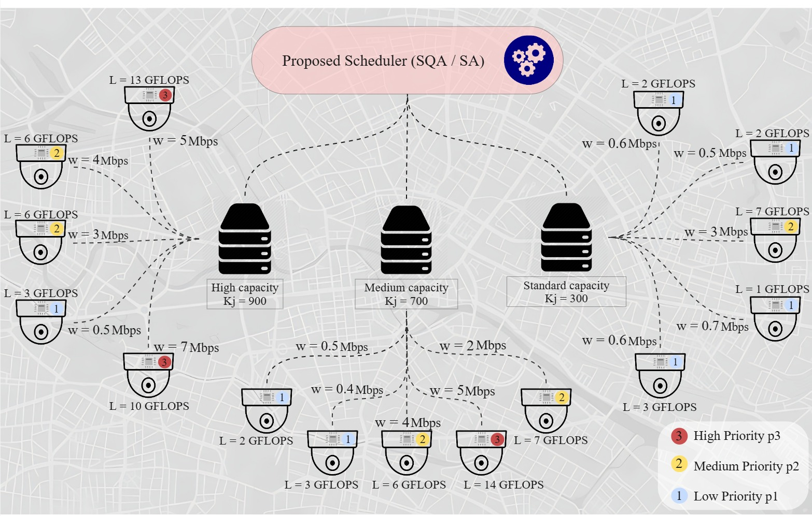
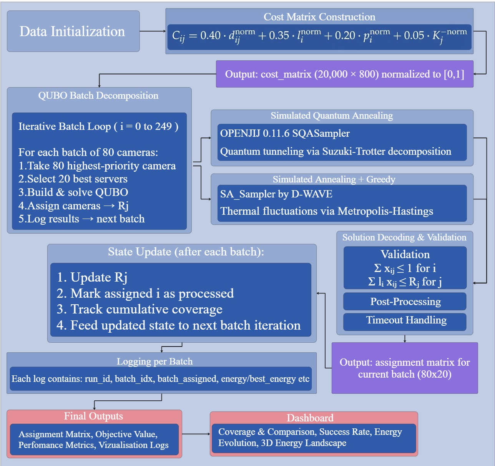
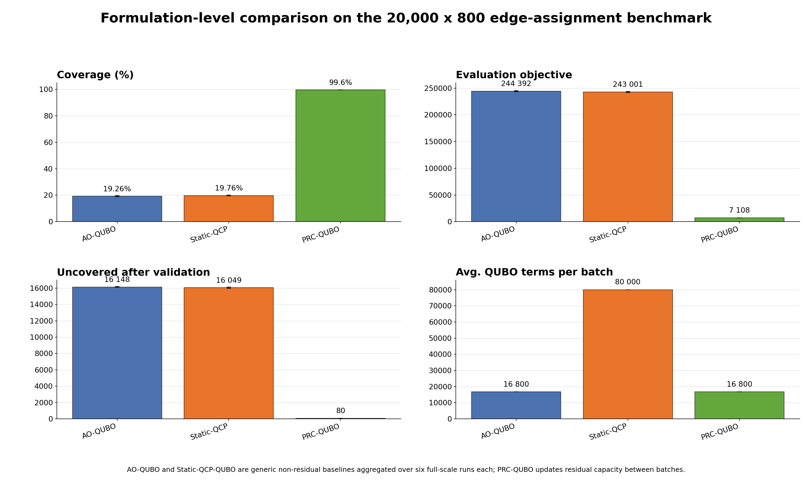
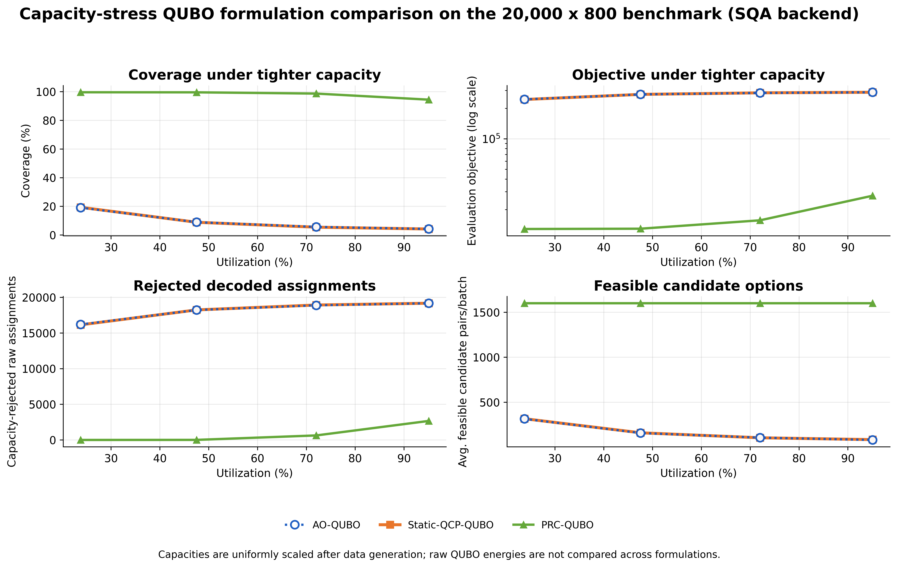
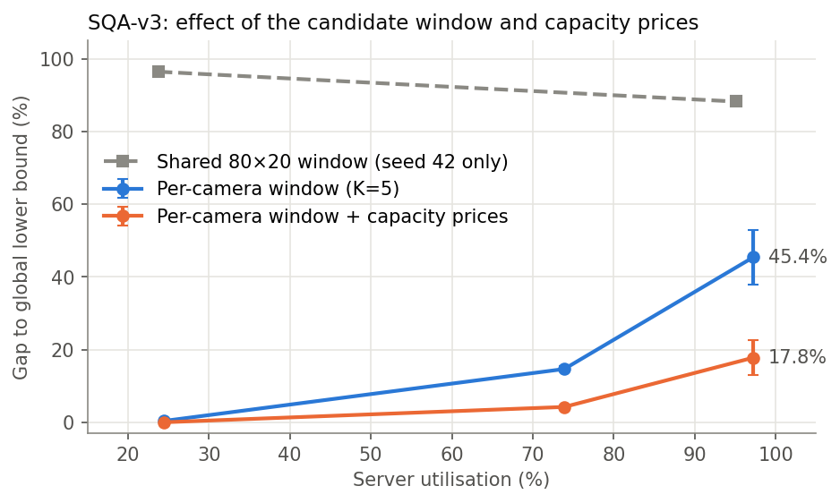
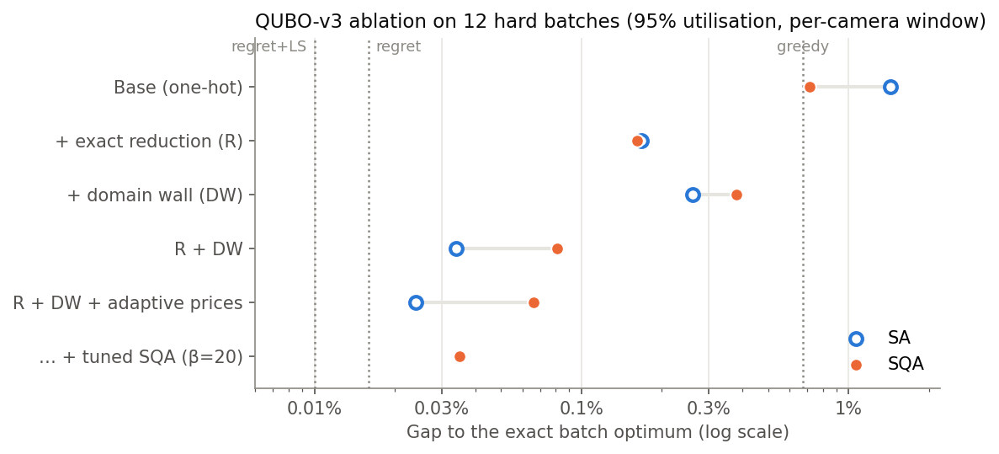
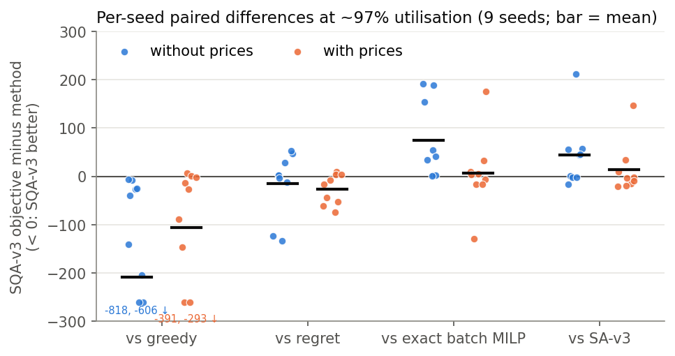
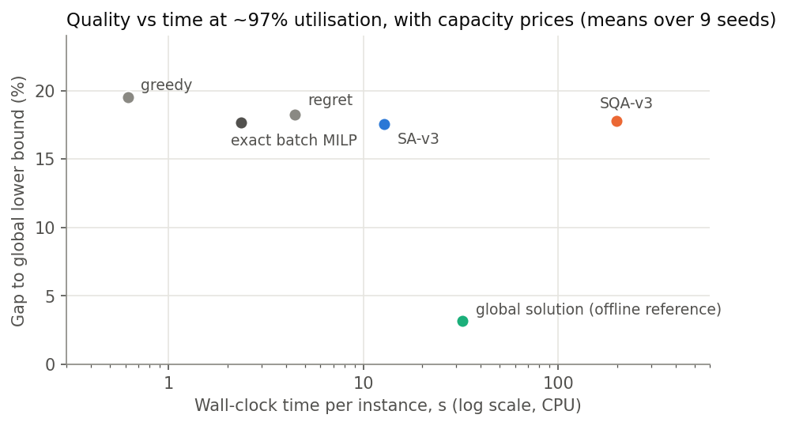
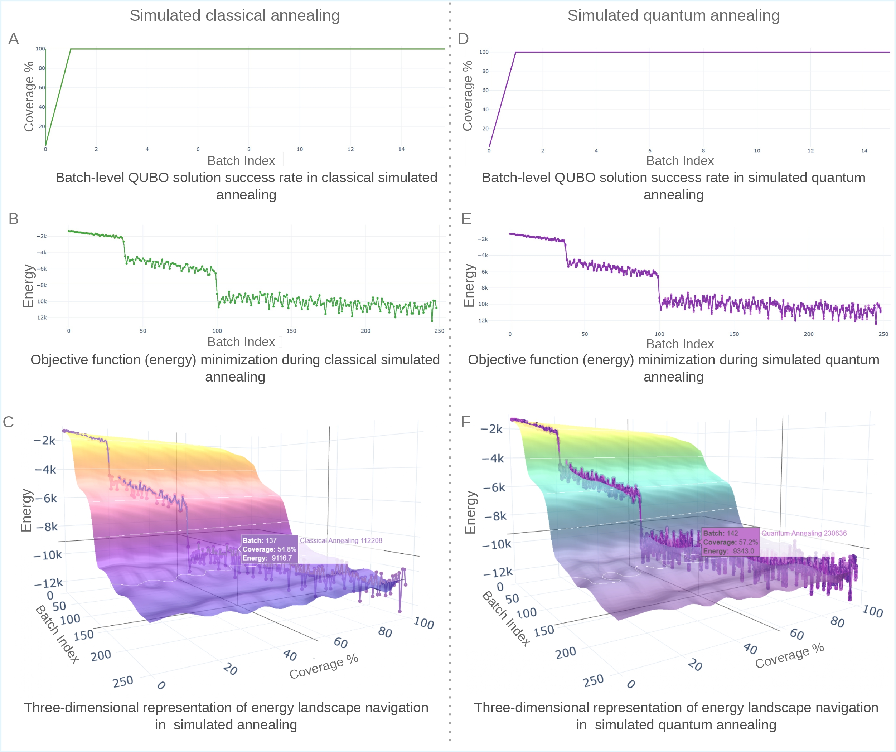

# Quantum-Sensor-Assignment

[](https://www.python.org/)
[](https://www.openjij.org/)
[](https://dwave-neal-docs.readthedocs.io/)
[](https://scipy.org/)
[](LICENSE)

QUBO decomposition for assigning video sensors (cameras) to capacitated edge servers in a smart-city setting. Each batch of cameras is turned into a QUBO and sampled with simulated quantum annealing (OpenJij SQA); the results are benchmarked against classical heuristics, exact batch MILP and a global Lagrangian reference.

> The accompanying manuscript is under revision. This repository contains the code, the raw experiment logs and the figures; the manuscript sources are added after publication.

## Contents

- [Problem setting](#problem-setting)
- [From the full problem to batch QUBOs](#from-the-full-problem-to-batch-qubos)
- [QUBO-v3 formulation](#qubo-v3-formulation)
- [Solving and decoding](#solving-and-decoding)
- [How we got here: formulation history](#how-we-got-here-formulation-history)
- [Results](#results)
- [Annealing dynamics](#annealing-dynamics)
- [Repository layout](#repository-layout)
- [OpenJij installation notes](#openjij-installation-notes)
- [Reproducing the results](#reproducing-the-results)
- [Notes on earlier versions](#notes-on-earlier-versions)
- [Citation](#citation)
- [License and acknowledgments](#license-and-acknowledgments)

## Problem setting



*Schematic of the simulated environment: cameras with priority classes, loads and bandwidth demands, and heterogeneous edge servers on a 1000 × 1000 plane.*

Let

- $C$ be the set of cameras, $|C| = N$ (default 20,000);
- $S$ be the set of edge servers, $|S| = M$ (default 800);
- $x_{ij}\in\{0,1\}$ indicate that camera $i$ is assigned to server $j$;
- $p_i\in\{1,2,3\}$ be the priority of camera $i$ (3 = high, 15% of cameras; 2 = medium, 25%; 1 = low, 60%);
- $l_i$ be its computational load in GFLOPS (high 8–15, medium 4–8, low 1–3);
- $K_j$ be the capacity of server $j$ (three server classes: 800–1000, 400–800, 200–400);
- $d_{ij}$ be the Euclidean distance between camera $i$ and server $j$.

The assignment cost is a min–max normalised mix of distance, load, priority and server capacity:

```math
c_{ij} = \operatorname{norm}_{[0,1]}\!\Big(0.40\,\tilde d_{ij} + 0.35\,\tilde l_i + 0.20\,\tfrac{3-p_i}{2} + 0.05\,\tilde K_j^{-1}\Big).
```

All methods are evaluated with the same objective:

```math
\min_x\; F(x)=\sum_{i\in C}\sum_{j\in S} w_i\,c_{ij}\,x_{ij} \;+\; P\,\Big|\{i:\textstyle\sum_j x_{ij}=0\}\Big|,
\qquad w_i = 4-p_i,\quad P = 15,
```

```math
\text{s.t.}\quad \sum_{j} x_{ij}\le 1\;\;\forall i, \qquad \sum_{i} l_i\,x_{ij}\le K_j\;\;\forall j .
```

This is a generalised assignment problem with optional coverage. Utilisation is varied by scaling every capacity by the same factor $s\in\{1.0, 0.5, 0.33, 0.25\}$, which gives $\sum_i l_i / \sum_j sK_j \approx$ 24%, 48%, 72–76% and 95–98% for the seeds used here.

The instance is fully determined by the seed (`CapacityStressExperiment.generate_realistic_data()` in `qsa/capacity_stress_experiment.py`).

## From the full problem to batch QUBOs

Cameras are processed online, in descending order of $p_i l_i$, in batches $B_t$ of 80. Each batch sees only the residual capacities left by the previous batches:

```math
R_j^{(t)} = K_j - \sum_{\tau<t}\sum_{i\in B_\tau} l_i\,x_{ij}.
```

For every batch $t$ we solve the subproblem

```math
\min_x \sum_{i\in B_t}\sum_{j\in S_i^{(t)}} w_i c_{ij} x_{ij} + P\,\#\{i\in B_t\ \text{uncovered}\}
\quad\text{s.t.}\quad \sum_j x_{ij}\le 1,\;\; \sum_{i\in B_t} l_i x_{ij}\le R_j^{(t)},
```

where $S_i^{(t)}$ is the candidate set of camera $i$. The batch assignment is committed and $R^{(t+1)}$ is updated. The same batch sequence and residual update are used by every method, so methods differ only in how each batch is solved.

The global problem without batches is used as a reference: the Lagrangian relaxation of the capacity constraints gives a lower bound, and a Lagrangian-guided regret heuristic with local search gives a global feasible solution (`qsa/global_bound_check.py`). This offline reference is not a competitor for the online setting; it tells how far any batch method is from the best achievable objective.

## QUBO-v3 formulation



*Batch-decomposed QUBO pipeline (drawn for the first submission). QUBO-v3 keeps the same loop: residual state → candidate servers → batch QUBO → SQA → decoding and validation → residual update; the steps below replace the internals of the "QUBO batch decomposition" and "Decoding" blocks.*

### 1. Candidate window per camera

In the first submission all 80 cameras of a batch shared the same 20 servers, so most cameras were far from their candidates. QUBO-v3 gives each camera its own $K=5$ cheapest servers that can still host it:

```math
S_i^{(t)} = \operatorname*{arg\,min}_{\substack{J\subseteq S,\ |J|=K\\ l_i\le R_j^{(t)}\ \forall j\in J}} \sum_{j\in J}\hat c_{ij},
\qquad \hat c_{ij}= w_i c_{ij} + u_j\, l_i .
```

### 2. Capacity prices

The prices $u_j\ge 0$ come from the Lagrangian relaxation of the full problem, computed once per instance by projected subgradient ascent:

```math
L(u)=\sum_i \min\Big(P,\ \min_j \big(w_i c_{ij}+u_j l_i\big)\Big) - \sum_j u_j K_j,
\qquad u \leftarrow \big[u + \eta_k\, g(u)\big]_+ ,
```

with $g_j(u)=\sum_{i:\,j=\arg\min} l_i - K_j$. The priced cost $\hat c_{ij}$ is used both for the window and as the decision cost inside the QUBO; the objective $F$ is always evaluated with the true cost. Prices make early batches leave room on servers that later batches need.

### 3. Exact reduction

Server $j$ is *safe* in batch $t$ if all cameras that list it as a candidate fit together: $\sum_{i:\,j\in S_i^{(t)}} l_i \le R_j^{(t)}$. A camera whose cheapest candidate is safe is fixed to it before sampling. This never removes an optimal solution, and safe servers need no capacity term. At high utilisation it fixes about 59 of 80 cameras and shrinks the QUBO from ~480 to ~100 variables.

### 4. Domain-wall encoding of the choice

For every free camera, its options (candidate servers sorted by $\hat c_{ij}$, plus a dummy option "unassigned" with cost $P$) are $o_0,\dots,o_{k-1}$. Instead of $k$ one-hot bits we use $k-1$ domain-wall spins $z_1,\dots,z_{k-1}$ with fixed boundaries $z_0=1$, $z_k=0$ (Chancellor, 2019):

```math
x_{i,o_m} = z_m - z_{m+1}, \qquad
H^{\mathrm{DW}}_i = \sum_{m=0}^{k-1} \bar c_{i,o_m}\,(z_m-z_{m+1}) \;+\; A\sum_{m=1}^{k-2} z_{m+1}(1-z_m),
```

where $\bar c_{i,o} = (\hat c_{i,o}-\min_o \hat c_{i,o})/\delta$ is the cost normalised by the median gap $\delta$ between a camera's two best options. The chosen option is the position of the wall. Moving the choice to a neighbouring option is a single spin flip at the wall, and any two options are connected by such flips through valid states only, so single-flip dynamics can move between options without crossing a penalty. With standard one-hot, moving a camera from server A to B has to pass through a state with two servers selected, which costs an energy barrier of about $A$ and freezes the annealer.

### 5. Capacity penalty

For every server that can overflow, with $a_i = l_i/R_j^{(t)}$ and the load of fixed cameras $f_j$:

```math
S_j = f_j + \sum_{i} a_i\,x_{ij}, \qquad
H^{\mathrm{cap}}_j = W_j\big[(\lambda_1-2)\,S_j + S_j^2\big] + A\,\mu_j\,S_j ,
```

an unbalanced penalisation of $S_j\le 1$ without slack variables (Montañez-Barrera et al., 2022), with $\lambda_1=0.2$ and $W_j=\lambda_{\mathrm{cap}}A\,\omega_j$.

### 6. Adaptive resampling

The batch Hamiltonian is

```math
H^{(t)} = \sum_{i\ \text{free}} H^{\mathrm{DW}}_i + \sum_{j\ \text{not safe}} H^{\mathrm{cap}}_j .
```

After sampling, the best read is decoded. If it overflows server $j$ by $\rho_j$, the price and weight of that server are raised, $\mu_j \leftarrow \mu_j + 0.5\,(1+\rho_j)$, $\omega_j \leftarrow 2\,\omega_j$, and the batch is resampled (at most 3 rounds). The best decoded solution over all rounds is kept.

## Solving and decoding

OpenJij's SQA samples the path-integral (Suzuki–Trotter) representation of the transverse-field Ising model obtained from $H^{(t)}$:

```math
H_{\mathrm{SQA}} = \frac{1}{P_T}\sum_{k=1}^{P_T} H^{(t)}\big(\sigma^{(k)}\big) - J_\perp \sum_{k=1}^{P_T}\sum_u \sigma_u^{(k)}\sigma_u^{(k+1)},
\qquad J_\perp = -\frac{T}{2}\ln\tanh\frac{\Gamma}{P_T T}.
```

| Setting | Value |
|---|---|
| reads per call | 10 |
| sweeps | 2000 |
| Trotter slices $P_T$ | 8 |
| $\beta$ / $\gamma$ | 20 / 1 |
| seed | derived from instance seed and batch index |

Decoding: each camera takes the option at its wall position. If a server is still overloaded, the least valuable cameras on it (per unit of load) are removed and re-inserted greedily into their cheapest feasible option; the number of such repairs is logged. Neal SA with the same QUBO, reads and sweeps is run as a solver control (SA-v3).

## How we got here: formulation history

The repository keeps every formulation that was tested, because each step fixed a concrete failure of the previous one.

| Formulation | Capacity in the QUBO | What went wrong or what it fixed |
|---|---|---|
| AO-QUBO | none | valid assignments become infeasible once earlier batches consume capacity; coverage ≈ 19% |
| Static-QCP-QUBO | initial capacity $K_j$ | same failure: the penalty describes the starting state, not the residual one |
| PRC-QUBO | residual $R_j^{(t)}$ in linear terms | coverage 99.6% at low load; breaks at 95% utilisation (94.4%); its one-hot penalty is weaker than the rewards, so the ground state selects ~3 servers per camera |
| CC-PRC-QUBO | + pairwise conflicts $\eta\, l_i l_k/R_j^2$ | stable coverage at 95% utilisation, 80,000 QUBO terms per batch |
| **QUBO-v3** | per-camera window, prices, reduction, domain wall, adaptive penalty | ~100 variables per batch, SQA within ±0.15% of strong classical methods |

The first-submission formulations are written out in [`legacy/README_legacy.md`](legacy/README_legacy.md):

```math
H_t^{\mathrm{PRC}} = \sum_{i\in B_t}\sum_{j\in S_t}\phi_{ij}^{(t)}x_{ij} + \lambda\sum_{i\in B_t}\sum_{j<k} x_{ij}x_{ik},
\qquad
\phi_{ij}^{(t)} = \begin{cases} -\alpha\,r_i(1-c_{ij}), & l_i\le R_j^{(t)}\\ \beta, & l_i>R_j^{(t)}\end{cases}
```

```math
H_t^{\mathrm{CC\text{-}PRC}} = H_t^{\mathrm{PRC}} + \eta\sum_{j\in S_t}\sum_{i<k}\frac{l_i l_k}{(R_j^{(t)}+\epsilon)^2}\,x_{ij}x_{kj}.
```

First-submission formulation comparison and capacity-stress results (20,000 × 800, seed 42, shared 80 × 20 window):





## Results

All numbers below: 20,000 cameras × 800 servers, seeds 42–51, batches of 80, candidate window $K=5$. Seed 43 at scale 0.25 has utilisation 100.4% (infeasible) and is excluded from that level. Full tables: [`results/v3/campaign/campaign_summary.md`](results/v3/campaign/campaign_summary.md).

### Effect of the architecture



The per-camera window and the capacity prices matter far more than the choice of solver. At ~24% utilisation every batch method is within 0.4% of the global optimum; at ~97% the prices cut the gap from 45% to 18%. The remaining gap is the cost of deciding online, batch by batch.

### Ablation of the QUBO components



Gap to the exact batch optimum (HiGHS MILP) on the 12 hardest batches of seed 42 at 95% utilisation. Reduction and the domain wall bring pure SQA from 0.72% to 0.08%; adaptive prices and a colder schedule bring it to 0.03–0.04%, below greedy (0.68%) and close to regret (0.016%).

### Paired comparison against classical methods

| Utilisation | Architecture | vs greedy | vs regret | vs exact batch MILP | vs SA-v3 |
|---|---|---|---|---|---|
| ~74% | with prices | −0.69 (7/0/3) | +0.90 (2/0/8, p=0.06) | +0.92 | −0.26 |
| ~97% | without prices | −208.5 (9/0/0, p=0.004) | −15.7 (4/0/5) | +74.2 (0/0/9, p=0.004) | +43.9 |
| ~97% | with prices | −106.0 (7/0/2, p=0.027) | −26.7 (6/0/3, p=0.074) | +6.4 (4/0/5, p=1.0) | +13.2 |

Mean objective difference SQA-v3 minus method (negative = SQA-v3 better), then SQA better / tie / worse over seeds, then the Wilcoxon signed-rank p-value where relevant.



### Quality versus time

| Method (~97%, with prices) | Objective | Gap to lower bound | Time per instance |
|---|---|---|---|
| greedy | 7,164 | 19.5% | 0.6 s |
| regret | 7,085 | 18.2% | 4.4 s |
| exact batch MILP | 7,052 | 17.7% | 2.3 s |
| SA-v3 | 7,045 | 17.6% | 12.8 s |
| **SQA-v3** | 7,058 | 17.8% | 198 s |
| global solution (offline reference) | 6,180 | 3.2% | 32 s |



SQA-v3 is significantly better than greedy, better than regret on average at high utilisation, and statistically indistinguishable from exact batch optimisation and SA-v3 once capacity prices are used. Its cost is runtime: SQA runs as CPU emulation here and is one to two orders of magnitude slower than the classical methods.

## Annealing dynamics



*Batch-level dynamics of the first-submission PRC-QUBO pipeline: classical simulated annealing (left, A–C) and simulated quantum annealing (right, D–F). A/D: per-batch QUBO success; B/E: best batch energy over the run; C/F: energy against batch index and coverage. Energies are those of the PRC-QUBO Hamiltonians and are not comparable across formulations. Produced by the dashboards in `legacy/first_submission/` (`app.py`, `app_Q.py`, `gui.py`).*

## Repository layout

```
qsa/                              current method and evaluation code
  capacity_stress_experiment.py   instance generator (seeded) and shared evaluation; also the AO/Static/PRC QUBOs
  batch_quality_benchmark.py      batch subproblems, exact MILP (HiGHS), greedy, regret, local search
  qubo_formulation_lab.py         QUBO-v2 experiments on hard batches
  qubo_v3_lab.py                  QUBO-v3 ablation on hard batches (gap to the batch optimum)
  v3_trajectory.py                end-to-end run of one method over all batches
  global_bound_check.py           global Lagrangian lower bound and global feasible solution
  campaign_aggregate.py           tables and paired statistics for the multi-seed campaign
baselines/                        GRASP, BRKGA, Tabu, regret best-fit, capacity-priced greedy,
                                  Lagrangian price, RC-greedy, small MILP oracle
legacy/                           revision-stage formulations (AO, Static-QCP, PRC, CC-PRC) and plotting scripts
  first_submission/               original pipeline: main_Q.py (PRC-QUBO + OpenJij SQA), main.py (SA),
                                  greedy.py (priority-capacity greedy), app.py / app_Q.py / gui.py (Dash dashboards),
                                  and the progress logs of the reported runs
  README_legacy.md                previous README with the full first-submission formulation
results/
  v3/campaign/                    10 seeds × 3 utilisation levels × 2 architectures × 5 methods + global reference
  v3/...                          development runs of QUBO-v3 (seed 42)
  legacy/                         summaries and run logs of the revision-stage experiments
docs/                             README figures (img/) and make_readme_figures.py to regenerate the QUBO-v3 plots
```

## OpenJij installation notes

The SQA-backed pipeline uses the standard Python package:

```python
import openjij as oj
sampler = oj.SQASampler()   # OpenJij 0.11.x: the constructor takes no parameters
response = sampler.sample_qubo(Q, num_reads=10, num_sweeps=2000, trotter=8, beta=20.0, seed=42)
```

Sampler parameters must be passed to `sample_qubo()`. In OpenJij 0.11.x, `SQASampler(num_reads=..., trotter=...)` raises `TypeError`; code that catches this and falls back to `SQASampler()` silently runs with the defaults (`num_reads=1`, `trotter=4`, `num_sweeps=1000`). Runs made before September 2026 were affected; `--sqa-legacy-defaults` in `qsa/capacity_stress_experiment.py` reproduces them.

This repository pins `openjij==0.11.6`.

### Recommended Windows installation

Use Python 3.10 in a clean virtual environment. This avoids many wheel and dependency issues that appear with newer Python versions.

```powershell
py -3.10 -m venv .venv
.\.venv\Scripts\Activate.ps1
python -m pip install --upgrade pip setuptools wheel
python -m pip install -r requirements.txt
```

Linux/macOS:

```bash
python3.10 -m venv .venv
source .venv/bin/activate
python -m pip install --upgrade pip setuptools wheel
python -m pip install -r requirements.txt
```

Verify:

```powershell
python -c "import openjij as oj; print(oj.__version__); print(oj.SQASampler())"
python -c "import neal; print('neal ok')"
```

If installation fails:

- Check that the active interpreter is the project venv: `python -c "import sys; print(sys.executable)"`.
- Upgrade build helpers: `python -m pip install --upgrade pip setuptools wheel`.
- Prefer Python 3.10 or 3.11 rather than Python 3.13.
- If pip tries to compile from source on Windows, install Microsoft C++ Build Tools and CMake.
- If exact reproduction is not required, try `pip install openjij` without the version pin.

### CPU, GPU, and CUDA

All experiments use the normal OpenJij Python interface on conventional CPU hardware. No physical quantum processor is used, and no CUDA-specific code path is enabled by the scripts.

- CUDA is **not required**, and installing CUDA alone will **not** make these scripts use the GPU.
- A GPU-enabled OpenJij experiment would need an explicit source/GPU build and code-level verification that the GPU backend is actually selected.
- Runtimes from a GPU build are not directly comparable with the CPU logs in this repository.

## Reproducing the results

Run from the repository root. Each script writes JSON summaries to its `--out` directory.

```bash
# global reference: Lagrangian lower bound and a global feasible solution
python qsa/global_bound_check.py --scales 1.0,0.33,0.25 --seed 42 --out logs_global

# one end-to-end run (method: exact | greedy | regret | sa_v3 | sqa_v3)
python qsa/v3_trajectory.py --method sqa_v3 --capacity-scale 0.25 --seed 42 --price --price-window --out logs_v3

# QUBO-v3 ablation on the hardest batches
python qsa/qubo_v3_lab.py --window percam --min-gap 0.005 --max-hard 12 --variants base,R,DW,R+DW --solvers SQA,SA --adaptive-rounds 3 --beta 20

# rebuild the campaign tables from the archived logs
python qsa/campaign_aggregate.py results/v3/campaign
```

The full campaign is the job list in `results/v3/campaign/jobs.txt` (330 runs, about 2.5 CPU-hours).

First-submission pipeline (writes to `logs/` and `logs_openjij_windows/` in the working directory):

```bash
cd legacy/first_submission
python main_Q.py     # PRC-QUBO + SQA
python main.py       # PRC-QUBO + SA
python app_Q.py      # dashboard on http://127.0.0.1:8051
```

## Notes on earlier versions

The first submission reported PRC-QUBO results that should not be reused:

- the reported objective of about 7,108 includes a global local-search refinement (`final_opt`); the same refinement gives 7,108.3 for a plain greedy;
- earlier SQA runs used the OpenJij defaults (1 read, 4 Trotter slices) because of the constructor issue above, so the reported SQA/SA speed ratio compares 1 read with 50–150 reads;
- the 99.6% coverage figure comes from the 99.5% early-stop rule, not from the solver;
- in PRC-QUBO the one-hot penalty (15) is smaller than the assignment reward (up to 75), so raw samples select about three servers per camera and the decoder makes the assignment.

## Citation

```bibtex
@misc{mussabayev2026qsa,
  title  = {Quantum-Sensor-Assignment: QUBO decomposition for capacitated sensor-to-edge-server assignment},
  author = {Yedige Mussabayev},
  year   = {2026},
  url    = {https://github.com/Yedman3585/Quantum-Sensor-Assignment}
}
```

## License and acknowledgments

Released under the [MIT License](LICENSE).

The research and software development were led by Yedige Mussabayev. Scientific supervision and methodological guidance were provided by Artem Bykov. Additional scientific review and recommendations were provided by Evgeniy Lavrov.

References: N. Chancellor, "Domain wall encoding of discrete variables for quantum annealing and QAOA," *Quantum Sci. Technol.* 4, 045004 (2019); J. A. Montañez-Barrera et al., "Unbalanced penalization: a new approach to encode inequality constraints of combinatorial problems for quantum optimization algorithms," arXiv:2211.13914 (2022).
